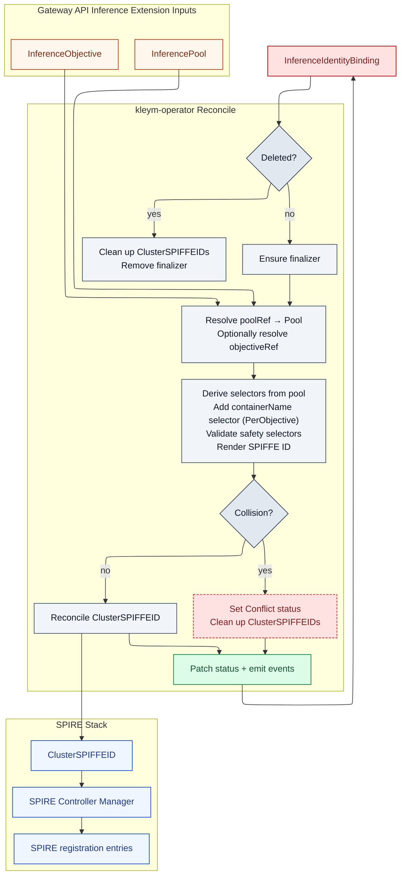

<div align="center">
  
  <h1>kleym</h1>
  <p><strong>Compile inference identity intent into deterministic SPIFFE identities for Kubernetes.</strong></p>
  <p>
    <a href="https://kleym.sonda.red">Documentation</a>
    ·
    <a href="docs/spec/_index.md">Specs</a>
    ·
    <a href="docs/examples/">Examples</a>
    ·
    <a href="docs/contributing.md">Contributing</a>
  </p>
</div>

<p align="center">
  <a href="https://github.com/sonda-red/kleym/actions/workflows/ci.yml">
    
  </a>
  <a href="https://github.com/sonda-red/kleym/actions/workflows/docs.yml">
    
  </a>
  
  <a href="LICENSE">
    
  </a>
</p>

Kleym connects [Gateway API Inference Extension](https://gateway-api-inference-extension.sigs.k8s.io/) resources to SPIFFE workload identity for Kubernetes.

The in-cluster `kleym-operator` watches inference intent from resources such as [`InferenceObjective`](https://gateway-api-inference-extension.sigs.k8s.io/api-types/inferenceobjective/) and [`InferencePool`](https://gateway-api-inference-extension.sigs.k8s.io/api-types/inferencepool/), then compiles that intent into deterministic SPIFFE identities and materializes them as SPIRE Controller Manager `ClusterSPIFFEID` resources. The companion `kleym` CLI is a read-only inspection tool for the rendered identity state.

## Where kleym fits

- The [Gateway API Inference Extension](https://gateway-api-inference-extension.sigs.k8s.io/) describes inference workloads and request objectives in Kubernetes.
- `kleym-operator` turns that intent into workload identity registrations with tenant-safe selectors.
- SPIRE Controller Manager applies those registrations so SPIRE can issue identities to the matching workloads.

## Why kleym

- Derives stable SPIFFE identities from Gateway API Inference Extension resources instead of ad hoc labels.
- Keeps selector rendering tenant-safe by intersecting namespace, service account, pool-derived selectors, and optional container discrimination.
- Delegates identity issuance and rotation to SPIRE Controller Manager instead of writing SPIRE entries directly.

## Scope boundary

Kleym stops at identity registration. `kleym-operator` does not deploy inference workloads, route inference traffic, or evaluate request policy.

## How it works

- `InferenceIdentityBinding` declares identity intent for one `InferencePool` and, when needed, one `InferenceObjective`.
- `kleym-operator` resolves the pool directly and validates any objective subject against that pool.
- The controller renders deterministic selectors and SPIFFE IDs from those inputs.
- Managed `ClusterSPIFFEID` resources are reconciled for SPIRE Controller Manager.

## Quickstart

Prerequisites:

- Go `1.26+`
- Docker
- `kubectl`
- Access to a Kubernetes cluster with the Gateway API Inference Extension [`InferencePool`](https://gateway-api-inference-extension.sigs.k8s.io/api-types/inferencepool/) CRD, plus [`InferenceObjective`](https://gateway-api-inference-extension.sigs.k8s.io/api-types/inferenceobjective/) when using `PerObjective`
- SPIRE Controller Manager with the `ClusterSPIFFEID` CRD
- Docker for Kind-backed e2e; the e2e targets bootstrap `kind` and Chainsaw under `bin/`

Run the controller locally:

```sh
make run
```

Install CRDs and deploy the controller:

```sh
make install
make deploy IMG=ghcr.io/sonda-red/kleym-operator:latest
```

Install the latest kleym operator from the root GitOps path:

```sh
kubectl apply -k https://github.com/sonda-red/kleym//deployment?ref=main
```

For release-pinned installs, pin the manifest ref and controller image tag
together. See [`docs/install.md`](docs/install.md) for
Kustomize, Flux, and Argo CD examples.

Run validation:

```sh
make test
make lint
make test-e2e-chainsaw KEEP_KIND=true
```

Build the inspection CLI:

```sh
make build-cli
bin/kleym inspect binding <name> -n <namespace>
```

Use `-o json` for automation. See [`docs/cli/`](docs/cli/) for CLI usage,
results, inspection report fields, findings, and exit codes.

## Reconcile Flow



## Documentation

Docs live under [`docs/`](docs/), with the published site at <https://kleym.sonda.red>.

| Topic | What it covers |
| --- | --- |
| [`docs/install.md`](docs/install.md) | Local run, deployment, GitOps install, metrics, and validation commands |
| [`docs/concepts.md`](docs/concepts.md) | GAIE inputs, identity modes, container discrimination, and selector safety |
| [`docs/architecture.md`](docs/architecture.md) | End-to-end controller flow |
| [`docs/demo.md`](docs/demo.md) | Reference binding-to-`ClusterSPIFFEID` walkthrough |
| [`docs/examples/`](docs/examples/) | Concrete manifests and expected outcomes |
| [`docs/reference/`](docs/reference/) | API fields, conditions, managed resources, compatibility, dependencies, and GAIE compatibility |
| [`docs/troubleshooting.md`](docs/troubleshooting.md) | Binding conditions, missing CRDs, and collision triage |
| [`docs/design/`](docs/design/) | Controller design notes and downstream handoff patterns |
| [`docs/cli/`](docs/cli/) | CLI usage, results, inspection report, findings, and exit codes |
| [`docs/spec/operator.md`](docs/spec/operator.md) | Authoritative operator product, API, and reconciliation behavior |
| [`docs/spec/cli.md`](docs/spec/cli.md) | Read-only inspection CLI contract |
| [`docs/contributing.md`](docs/contributing.md) | Contributor workflow and validation expectations |

Preview the docs site locally:

```sh
make docs-serve
```

Docs commands require Hugo Extended `0.146+`.

Build the static docs site:

```sh
make docs-build
```

## License

Apache-2.0
