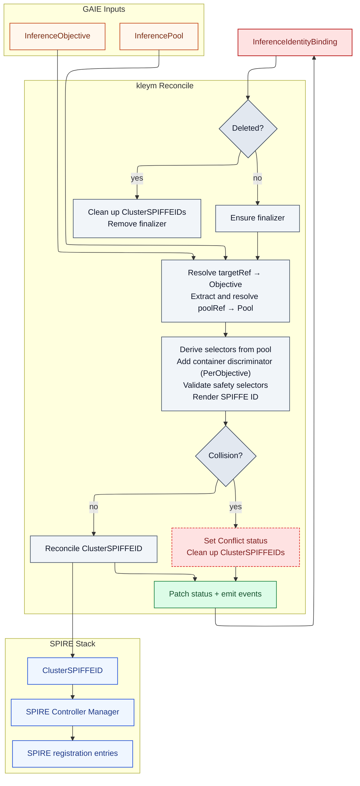

# kleym

`kleym` is a Kubernetes operator that compiles inference identity intent into deterministic SPIFFE identities and materializes them as SPIRE Controller Manager `ClusterSPIFFEID` resources.

`kleym` is an identity registration compiler. It does not deploy inference workloads, route inference traffic, or evaluate request policy.

## Reconcile Flow



## Quickstart

Prerequisites:

- Go `1.25+`
- Docker
- `kubectl`
- Access to a Kubernetes cluster
- `kind` for `make test-e2e`

Run the controller locally:

```sh
make run
```

Install CRDs and deploy the controller:

```sh
make install
make deploy IMG=<registry>/kleym:<tag>
```

Run tests:

```sh
make test
make lint
```

## Documentation

Docs live under [`docs/`](docs/).
Published docs: <https://kleym.sonda.red>.

- Overview:
  - [`docs/_index.md`](docs/_index.md): landing page
  - [`docs/concepts.md`](docs/concepts.md): identity model
  - [`docs/architecture.md`](docs/architecture.md): end-to-end controller flow
- Use:
  - [`docs/install.md`](docs/install.md): local run, deploy, and test commands
  - [`docs/examples/`](docs/examples): concrete manifests and expected outcomes
  - [`docs/reference/`](docs/reference): stable facts about API surface, conditions, and managed resources
  - [`docs/troubleshooting.md`](docs/troubleshooting.md): condition-driven debugging and dependency checks
  - [`docs/versioning.md`](docs/versioning.md): docs version snapshot workflow
- Design:
  - [`docs/spec.md`](docs/spec.md): the authoritative behavioral contract
  - [`docs/design/`](docs/design): internal design notes
- Development:
  - [`docs/contributing.md`](docs/contributing.md): contributor workflow and validation expectations

Preview the docs site locally:

```sh
make docs-serve
```

Docs commands require Hugo Extended `0.146+`.

Build the static docs site:

```sh
make docs-build
```

Build root and configured version snapshots:

```sh
make docs-build-versioned
```

## License

Apache-2.0
