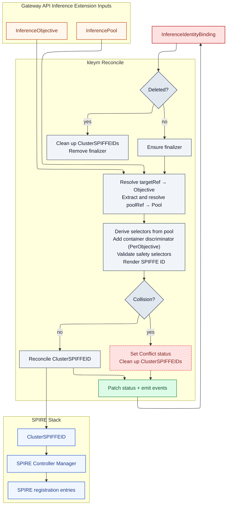

<div align="center">
  
  <h1>kleym</h1>
  <p><strong>Compile inference identity intent into deterministic SPIFFE identities for Kubernetes.</strong></p>
  <p>
    <a href="https://kleym.sonda.red">Documentation</a>
    ·
    <a href="docs/spec.md">Spec</a>
    ·
    <a href="docs/examples/">Examples</a>
    ·
    <a href="docs/contributing.md">Contributing</a>
  </p>
</div>

<p align="center">
  <a href="https://github.com/sonda-red/kleym/actions/workflows/ci.yml">
    
  </a>
  <a href="https://github.com/sonda-red/kleym/actions/workflows/docs.yml">
    
  </a>
  
  <a href="LICENSE">
    
  </a>
</p>

`kleym` is a Kubernetes operator for clusters that use the [Gateway API Inference Extension](https://gateway-api-inference-extension.sigs.k8s.io/). It reads inference intent from resources such as [`InferenceObjective`](https://gateway-api-inference-extension.sigs.k8s.io/api-types/inferenceobjective/) and [`InferencePool`](https://gateway-api-inference-extension.sigs.k8s.io/api-types/inferencepool/), then compiles that intent into deterministic SPIFFE identities and materializes them as SPIRE Controller Manager `ClusterSPIFFEID` resources.

## Where kleym fits

- The [Gateway API Inference Extension](https://gateway-api-inference-extension.sigs.k8s.io/) describes inference workloads and request objectives in Kubernetes.
- `kleym` turns that intent into workload identity registrations with tenant-safe selectors.
- SPIRE Controller Manager applies those registrations so SPIRE can issue identities to the matching workloads.

## Why kleym

- Derives stable SPIFFE identities from Gateway API Inference Extension resources instead of ad hoc labels.
- Keeps selector rendering tenant-safe by intersecting namespace, service account, pool-derived selectors, and optional container discrimination.
- Delegates identity issuance and rotation to SPIRE Controller Manager instead of writing SPIRE entries directly.

## Scope boundary

`kleym` is an identity registration compiler. It does not deploy inference workloads, route inference traffic, or evaluate request policy.

## How it works

- `InferenceIdentityBinding` declares identity intent for one `InferenceObjective`.
- `kleym` resolves that objective and its referenced `InferencePool`.
- The controller renders deterministic selectors and SPIFFE IDs from those inputs.
- Managed `ClusterSPIFFEID` resources are reconciled for SPIRE Controller Manager.

## Quickstart

Prerequisites:

- Go `1.26+`
- Docker
- `kubectl`
- Access to a Kubernetes cluster with the Gateway API Inference Extension [`InferenceObjective`](https://gateway-api-inference-extension.sigs.k8s.io/api-types/inferenceobjective/) and [`InferencePool`](https://gateway-api-inference-extension.sigs.k8s.io/api-types/inferencepool/) CRDs
- SPIRE Controller Manager with the `ClusterSPIFFEID` CRD
- `kind` for `make test-e2e`

Run the controller locally:

```sh
make run
```

Install CRDs and deploy the controller:

```sh
make install
make deploy IMG=ghcr.io/sonda-red/kleym:latest
```

Run validation:

```sh
make test
make lint
```

## Reconcile Flow



## Documentation

Docs live under [`docs/`](docs/), with the published site at <https://kleym.sonda.red>.

| Topic | What it covers |
| --- | --- |
| [`docs/install.md`](docs/install.md) | Local run, deployment, and test commands |
| [`docs/concepts.md`](docs/concepts.md) | Identity boundaries, selector safety, and scope |
| [`docs/architecture.md`](docs/architecture.md) | End-to-end controller flow |
| [`docs/demo.md`](docs/demo.md) | Reproducible binding-to-`ClusterSPIFFEID` walkthrough |
| [`docs/examples/`](docs/examples/) | Concrete manifests and expected outcomes |
| [`docs/reference/`](docs/reference/) | API surface, conditions, and managed resources |
| [`docs/troubleshooting.md`](docs/troubleshooting.md) | Condition-driven debugging and dependency checks |
| [`docs/versioning.md`](docs/versioning.md) | Docs version snapshot workflow |
| [`docs/spec.md`](docs/spec.md) | Authoritative product and API behavior |
| [`docs/design/`](docs/design/) | Internal design notes |
| [`docs/contributing.md`](docs/contributing.md) | Contributor workflow and validation expectations |

Preview the docs site locally:

```sh
make docs-serve
```

Docs commands require Hugo Extended `0.146+`.

Build the static docs site:

```sh
make docs-build
```

Build root and configured version snapshots:

```sh
make docs-build-versioned
```

## License

Apache-2.0
